# FunFind Forum

A web forum based on Spring Boot.

## Home Page

Homepage of FunFind Forum can show the threads in the order of latest or hottest.

The order of "hottest" threads will be calculated every 15 minutes.

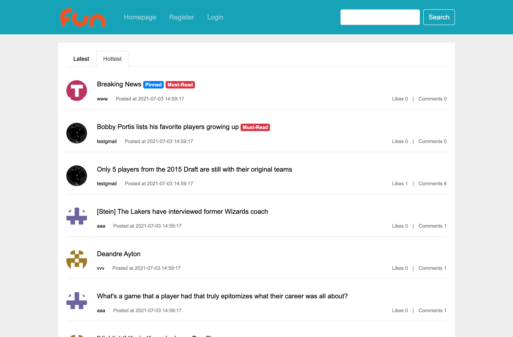

Users that have logged in can post new threads.

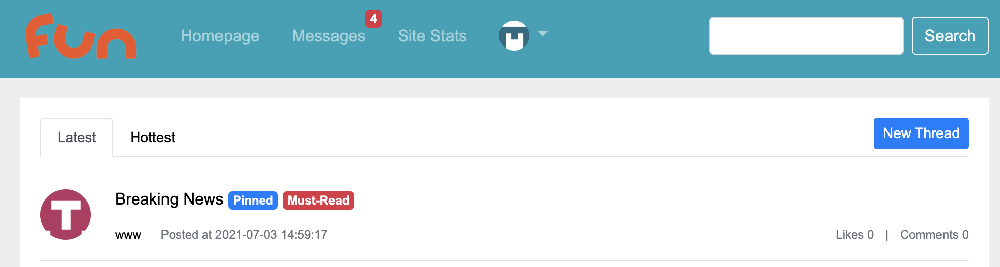

## Thread Details

Show the details and replies of a thread.

Users can like, comment, reply or write a post.

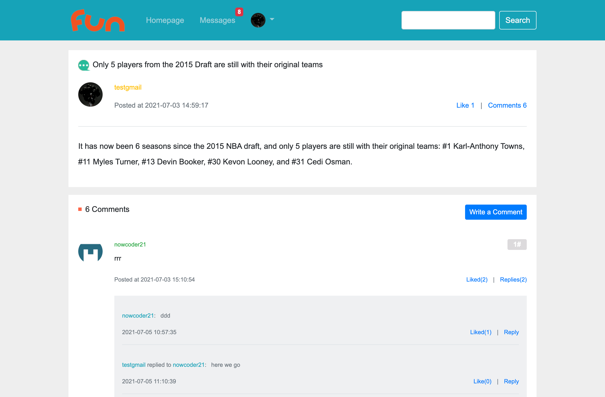

Only admin users can set the threads as must-read / pinned or delete the thread.

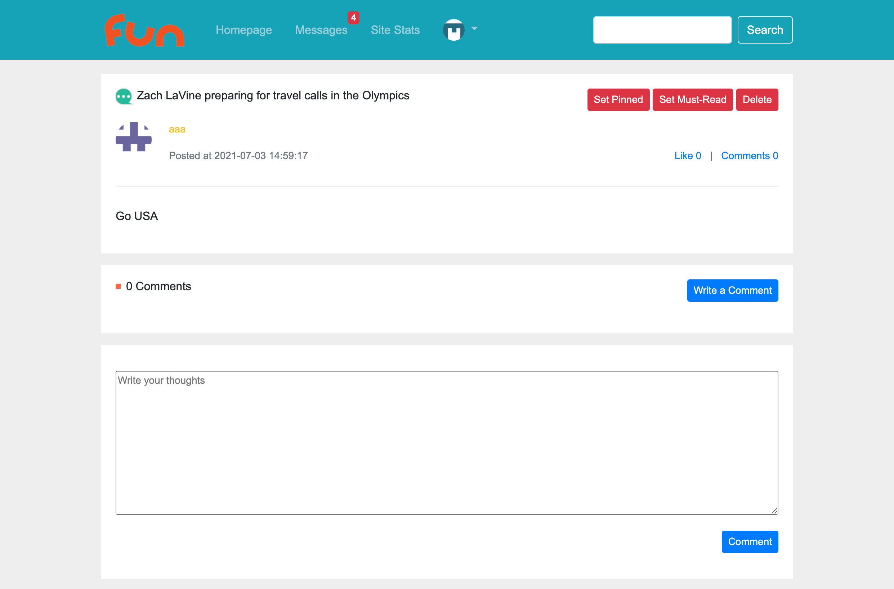

## Mails and Notifications

### DMs

Users can send direct mails to other users.

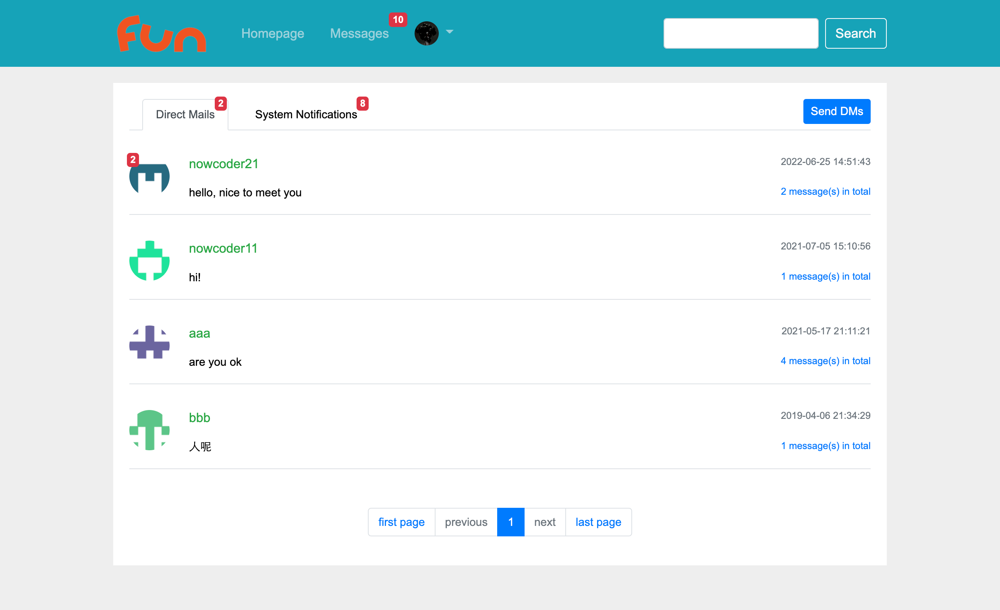

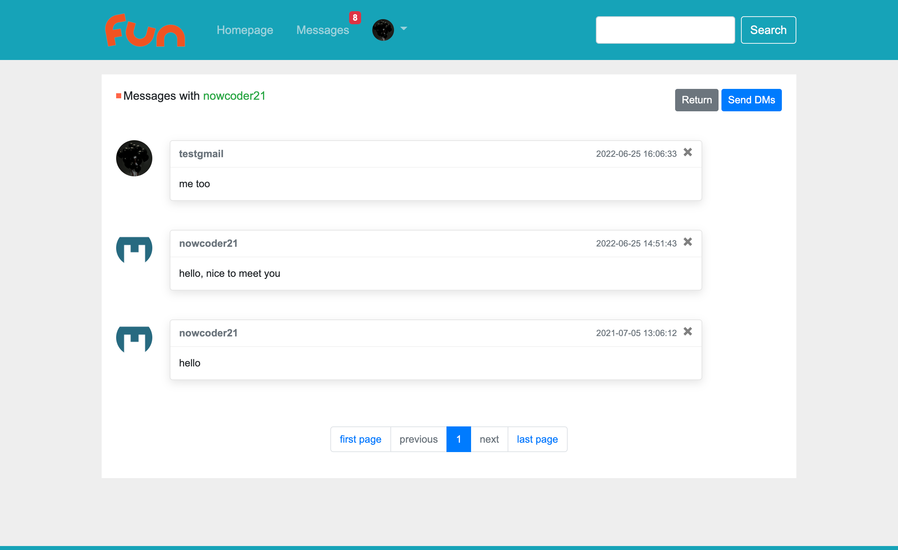

### Notifications

The system will send notifications to a user when some specific activities happen.

For example, being followed / being commented / getting likes from others.

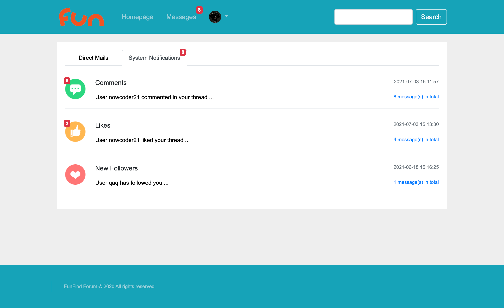

## Search

Search for keywords which may appear in posts or comments of the forum.

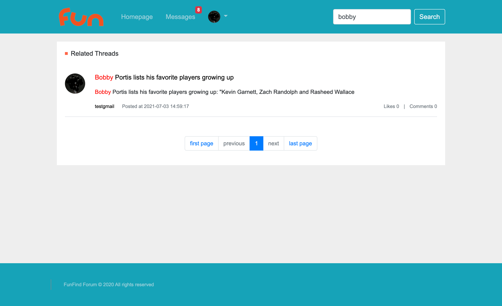

## Website Stats

Only admin users can see this page.

Admins could see the number of active users or unique visitors (UV) in a given period.

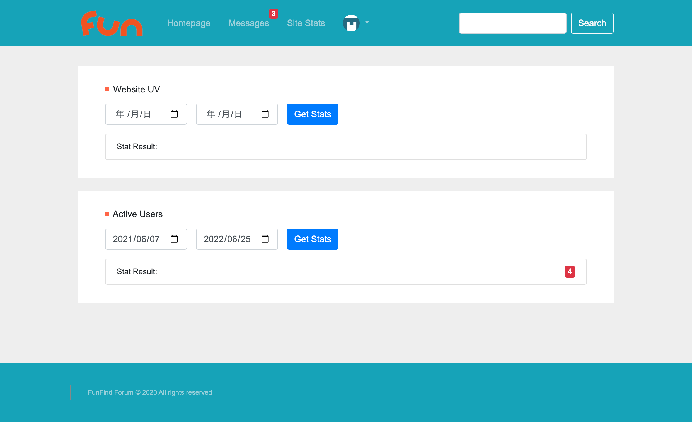

## Login & Register

Register action requires new users to verify their email address.

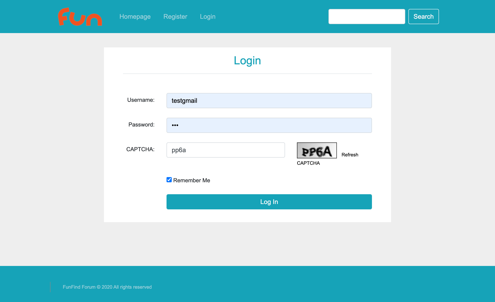

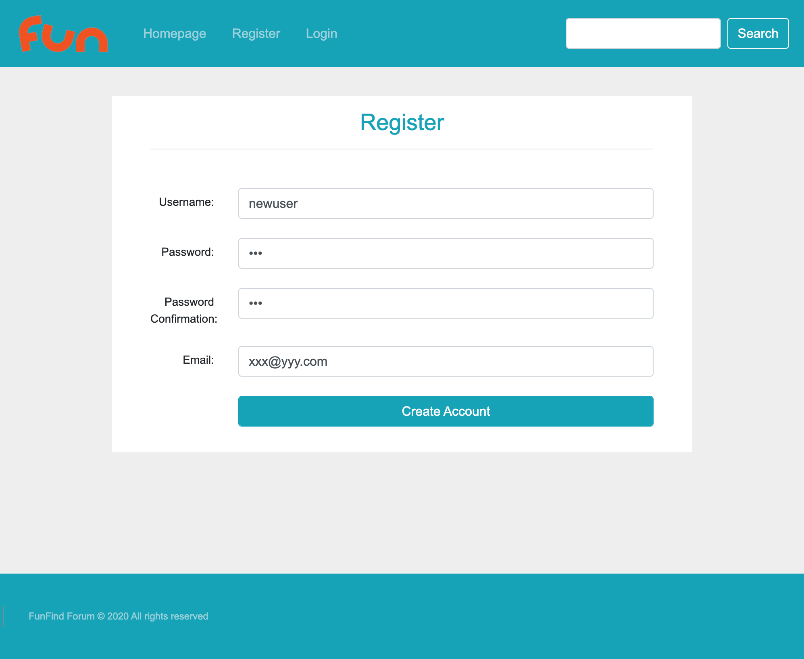

## User Profile & Settings

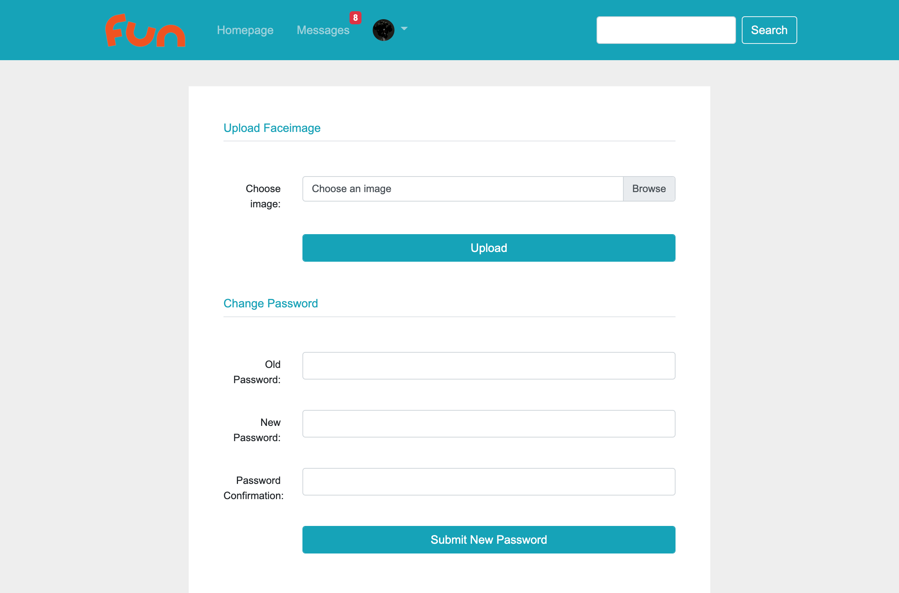

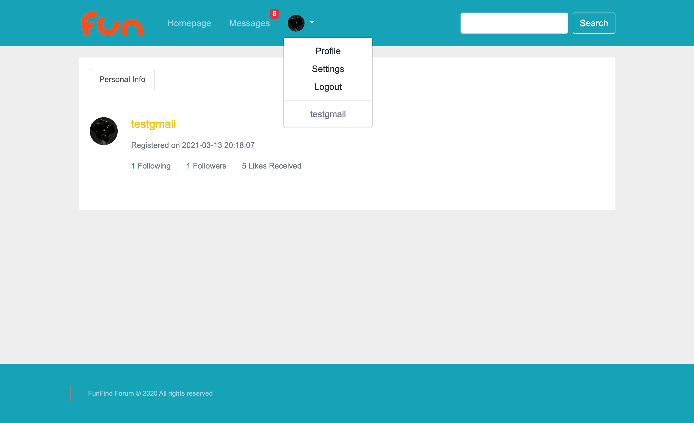

